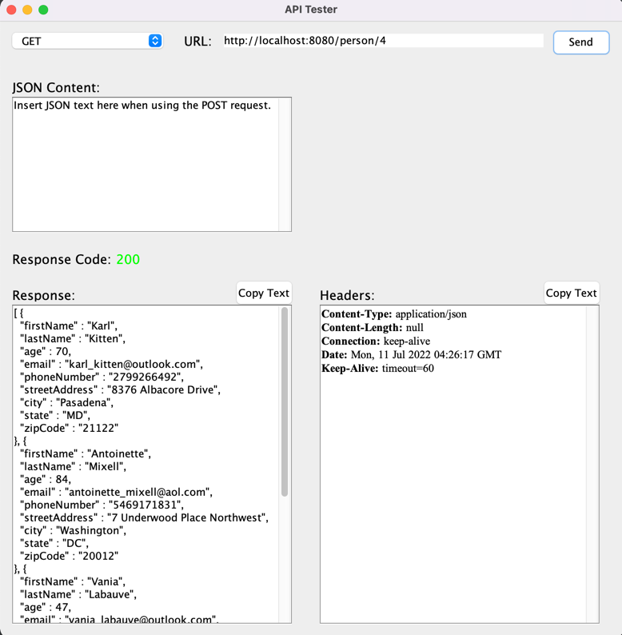

# API Tester
I've created this application using Java and Java Swing. API Tester
is a desktop GUI that allows users to test their API endpoints with 
a simple and clean user interface. Currently, this application supports
GET and POST requests, with plans to expand to more HTTP methods. 

# How To Use
Fork this repository to a directory of your choice.

Navigate to the root of the repository, and run  ```mvn clean install```

This command will build a jar file in ```/target/apitester.jar``` You can open this JAR file to run the application

Alternatively, you can run the main method in ```/src/main/java/GUI/Control.java```

# User Interface

## GET Request

To test a GET endpoint, make sure the dropdown is set to GET, insert a URL, and
click send. Here is an example test of me using a REST API I've created, that can be 
found [Here](https://github.com/ori-bibas/randomperson). 




After typing in the URL of the endpoint and clicking send, you will get returned to you:
the response code of the request, the response in JSON, and some headers
associated with the request. A copy to clipboard button has been provided for both
the JSON response and the request headers.

## POST Request

To test a POST endpoint, make sure the dropdown is set to POST, insert a URL,
and add the content you would like to send. The content must be in the form
of JSON, as the "Accept" request header is auto-set to "application/json". 
This app also expects a JSON return, too. Here is an example test of me using 
the REST API at [Reqres](https://reqres.in/).


Similar to the GET request, you will get the response code, response body, and
some headers returned. 